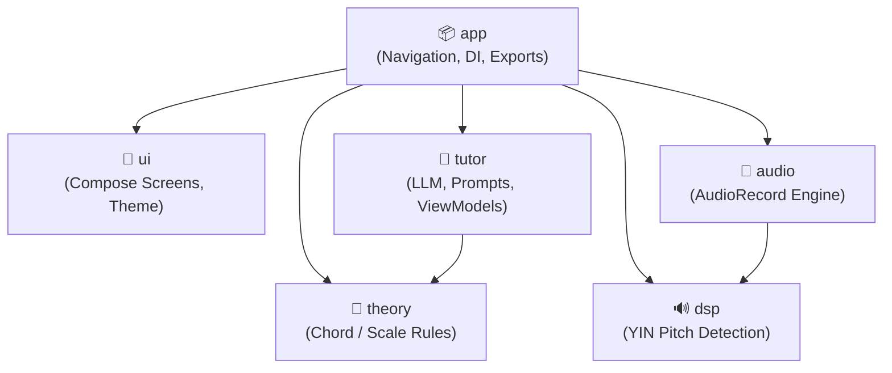
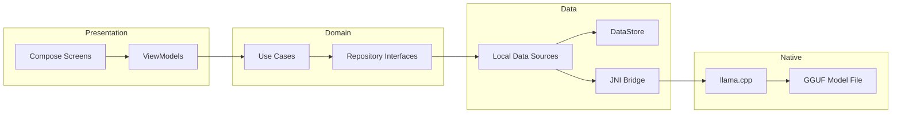
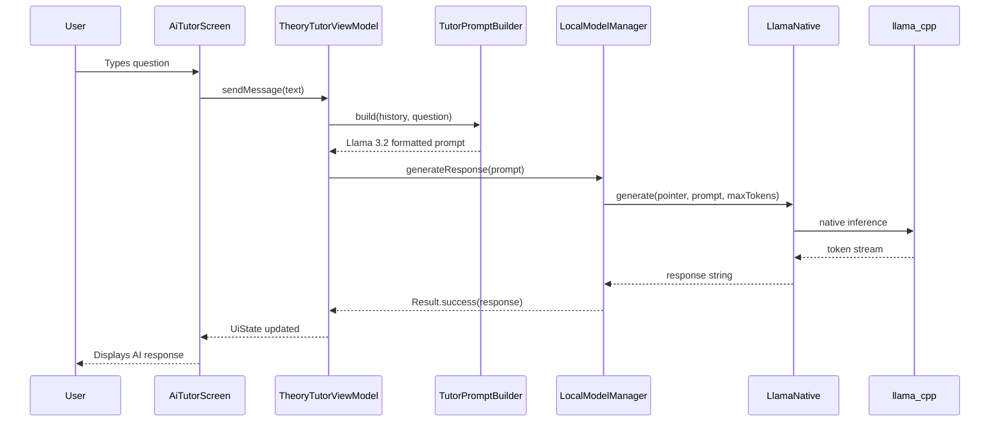
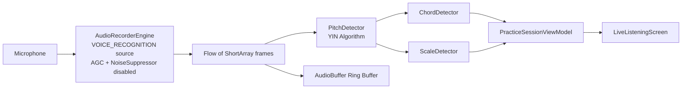
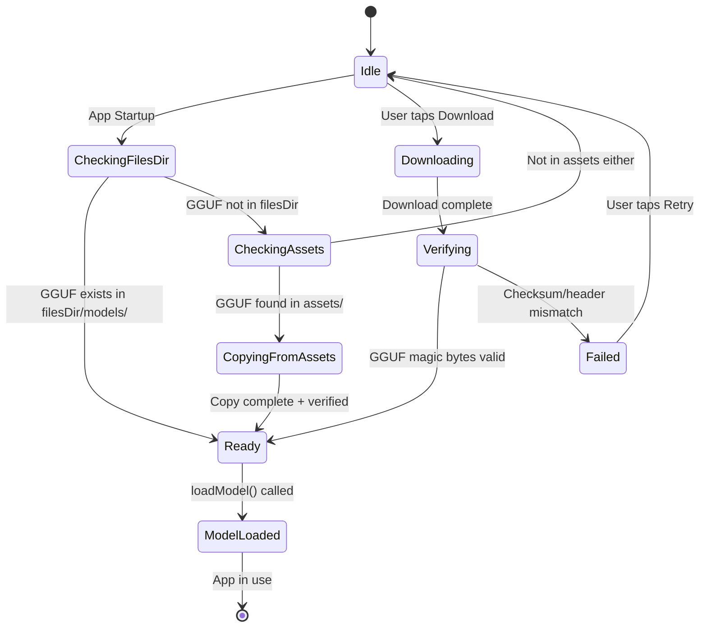
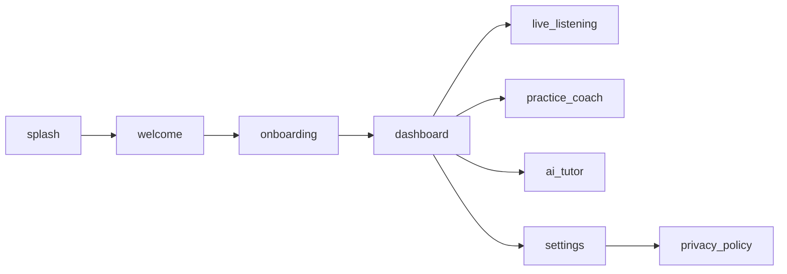
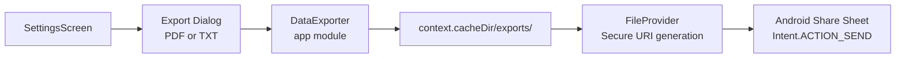

# Architecture

This document provides a comprehensive technical description of the Harmony-Lift architecture.

## 📋 Table of Contents

- [Principles](#principles)
- [Module Graph](#module-graph)
- [Clean Architecture Layers](#clean-architecture-layers)
- [Module Responsibilities](#module-responsibilities)
- [AI Pipeline](#ai-pipeline)
- [Audio Pipeline](#audio-pipeline)
- [Model Loading Flow](#model-loading-flow)
- [State Management](#state-management)
- [Navigation Graph](#navigation-graph)
- [Export Pipeline](#export-pipeline)
- [Dependency Graph (Gradle)](#dependency-graph-gradle)

---

## Principles

1. **Clean Architecture** — strict separation of Presentation, Domain, and Data layers.
2. **Offline-First** — all features function without any network connection after initial model download.
3. **Unidirectional Data Flow** — state flows down from ViewModels, events flow up from UI.
4. **No Cross-Module Violations** — `ui` never imports from `tutor`, `audio` never imports from `ui`.
5. **JNI Isolation** — all native (llama.cpp) code is contained within the `tutor` module's `data/local` package.

---

## Module Graph



---

## Clean Architecture Layers



---

## Module Responsibilities

| Module | Responsibility |
|--------|---------------|
| `app` | `MainActivity`, Navigation graph, WorkManager download, DataExporter, DI wiring |
| `ui` | All `@Composable` screens, `ThemePreferences`, Material 3 theme tokens |
| `tutor` | `LocalModelManager`, `LlamaNative` JNI declarations, `LlamaCppService`, `TutorPromptBuilder`, ViewModels |
| `audio` | `AudioRecorderEngine` (AudioRecord wrapper), `AudioBuffer` ring buffer |
| `dsp` | `PitchDetector` (YIN algorithm implementation) |
| `theory` | `ChordDetector`, `ScaleDetector` — pure Kotlin music theory logic |

---

## AI Pipeline



---

## Audio Pipeline



---

## Model Loading Flow



---

## State Management

All UI state is managed via `StateFlow` in ViewModels:

```kotlin
// Pattern used throughout the codebase
class TheoryTutorViewModel(...) : ViewModel() {
    private val _uiState = MutableStateFlow(TheoryTutorUiState())
    val uiState: StateFlow<TheoryTutorUiState> = _uiState.asStateFlow()
}
```

Theme persistence uses DataStore:

```kotlin
class ThemePreferences(context: Context) {
    val themeMode: Flow<ThemeMode> = context.dataStore.data.map { prefs ->
        ThemeMode.valueOf(prefs[THEME_MODE_KEY] ?: ThemeMode.SYSTEM.name)
    }
    suspend fun saveThemeMode(mode: ThemeMode) { ... }
}
```

---

## Navigation Graph



All navigation is handled in `MainActivity.kt` via `NavHost` and `NavController`.

---

## Export Pipeline



---

## Dependency Graph (Gradle)

```
app
├── :ui
├── :tutor
│   └── :theory
├── :audio
│   └── :dsp
├── :dsp
└── :theory
```

Key external dependencies:

| Library | Purpose |
|---------|---------|
| `androidx.navigation:navigation-compose` | In-app navigation |
| `androidx.work:work-runtime-ktx` | Background model download |
| `androidx.datastore:datastore-preferences` | Persistent settings |
| `androidx.compose:compose-bom` | Compose UI framework |
| `llama.cpp` (native .so) | On-device AI inference |
