# Harmony-Lift
<div align="center">

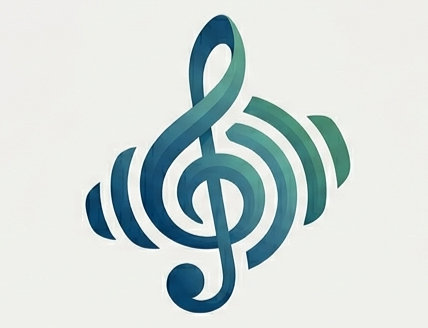

# 🎸 Harmony-Lift

**The Offline-First, Privacy-First AI Music Tutor for Android**

*Real-time pitch detection · Chord recognition · Local LLM coaching — zero cloud required.*

---

[](https://kotlinlang.org)
[](https://developer.android.com)
[](https://developer.android.com/jetpack/compose)
[](https://m3.material.io)
[](https://github.com/ggerganov/llama.cpp)
[](https://huggingface.co/bartowski/Llama-3.2-1B-Instruct-GGUF)
[](https://github.com/sayuj5/Harmony-Lift)
[](./LICENSE)
[](https://github.com/sayuj5/Harmony-Lift/releases)
[](https://developer.android.com/about/versions)
[](https://github.com/sayuj5/Harmony-Lift/stargazers)
[](https://github.com/sayuj5/Harmony-Lift/issues)
[](./CONTRIBUTING.md)

</div>

---

## 📋 Table of Contents

- [Overview](#-overview)
- [Why Harmony-Lift?](#-why-harmony-lift)
- [Features](#-features)
- [Screenshots](#-screenshots)
- [Architecture](#-architecture)
- [Tech Stack](#-tech-stack)
- [Folder Structure](#-folder-structure)
- [Installation](#-installation)
- [Model Setup](#-model-setup)
- [Build Instructions](#-build-instructions)
- [Roadmap](#-roadmap)
- [Performance](#-performance)
- [Privacy](#-privacy)
- [Known Issues](#-known-issues)
- [Contributing](#-contributing)
- [License](#-license)
- [Contributors](#-contributors)

---

## 🎯 Overview

**Harmony-Lift** is a premium, production-ready Android application that serves as a real-time AI music coach. It listens to your instrument playing, analyzes pitch, chords, and scales using a custom DSP pipeline, and provides intelligent, personalized music theory feedback — **entirely offline**, with **zero cloud dependency**.

### Problem Statement

Most music learning apps either:
1. Require expensive cloud AI (latency, privacy risk, cost)
2. Provide static lessons with no real-time feedback
3. Force you to be online to get any AI assistance

### Our Solution

Harmony-Lift runs **Llama 3.2 1B** directly on your Android device using a custom JNI bridge to `llama.cpp`. Your voice, your music, your data — **stays on your device, forever**.

---

## 🤔 Why Harmony-Lift?

| Feature | Harmony-Lift | Cloud-based Apps |
|---------|:---:|:---:|
| Works Offline | ✅ | ❌ |
| Zero Latency AI | ✅ | ❌ |
| Privacy Guaranteed | ✅ | ❌ |
| No Subscription | ✅ | ❌ |
| Real-time Pitch Detection | ✅ | Varies |
| Local LLM | ✅ | ❌ |
| No Data Collection | ✅ | ❌ |
| Open Source | ✅ | ❌ |

---

## ✨ Features

| Icon | Feature | Description |
|:----:|---------|-------------|
| 🧠 | **Offline AI Music Tutor** | Ask theory questions & receive intelligent feedback locally via Llama 3.2 |
| 🎵 | **Real-time Pitch Detection** | YIN algorithm for sub-50ms pitch tracking from your instrument |
| 🎸 | **Chord Detection** | Automatic chord identification from live audio |
| 🎼 | **Scale Recognition** | Identify scales and modes from your playing patterns |
| 👂 | **Ear Training** | Practice intervals and develop musical ear with AI guidance |
| 🏋️ | **Practice Coach** | Guided sessions with structured exercises and feedback |
| 📈 | **Progress Tracking** | XP system, streaks, and skill level progression |
| 🕒 | **Session History** | Review past practice sessions and identify patterns |
| 📄 | **PDF Export** | Generate professional practice reports as PDF |
| 📝 | **TXT Export** | Export plain text summaries for easy sharing |
| 🔒 | **100% Offline Inference** | Zero audio ever leaves your device |
| 🎨 | **Material 3 UI** | Beautiful, adaptive Design with Dynamic Color |
| 🌙 | **Dark Theme** | Full dark mode support with DataStore persistence |
| 🤖 | **Local LLM** | Llama 3.2 1B Instruct Q3 running natively via llama.cpp JNI |

---

## 📸 Screenshots

<div align="center">

| App Screen | App Screen | App Screen |
|:----------:|:----------:|:----------:|
| 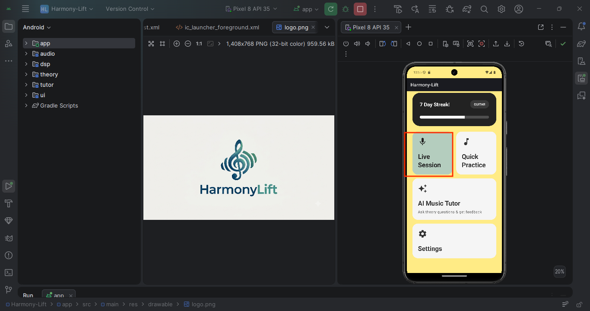 <br> *Home Dashboard* | 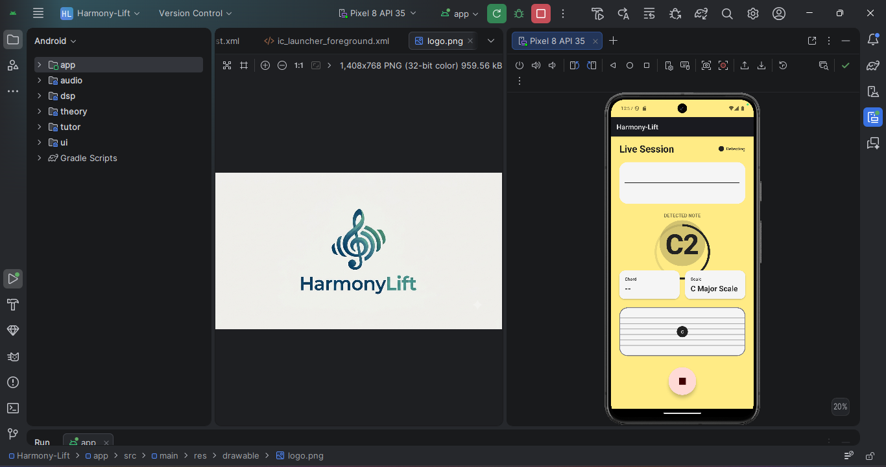 <br> *Live Listening* | 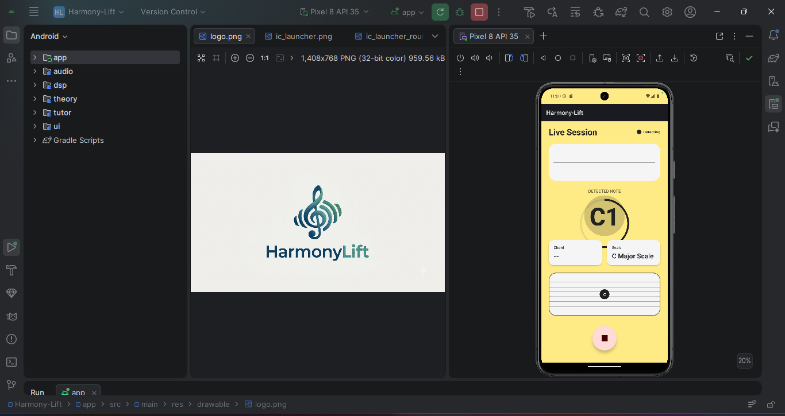 <br> *Chord Detection* |
| 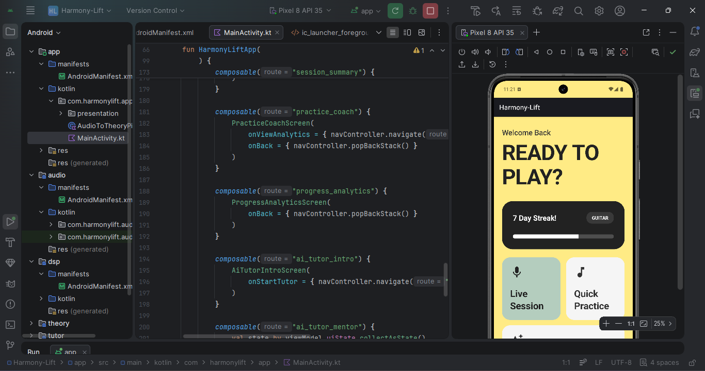 <br> *AI Tutor Chat* | 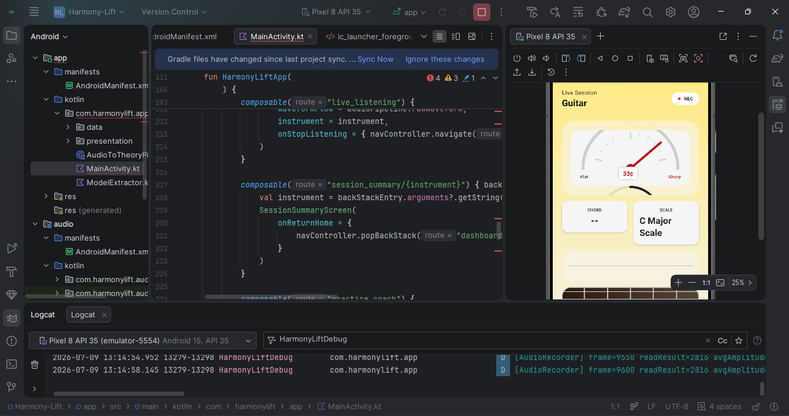 <br> *Practice Session* | 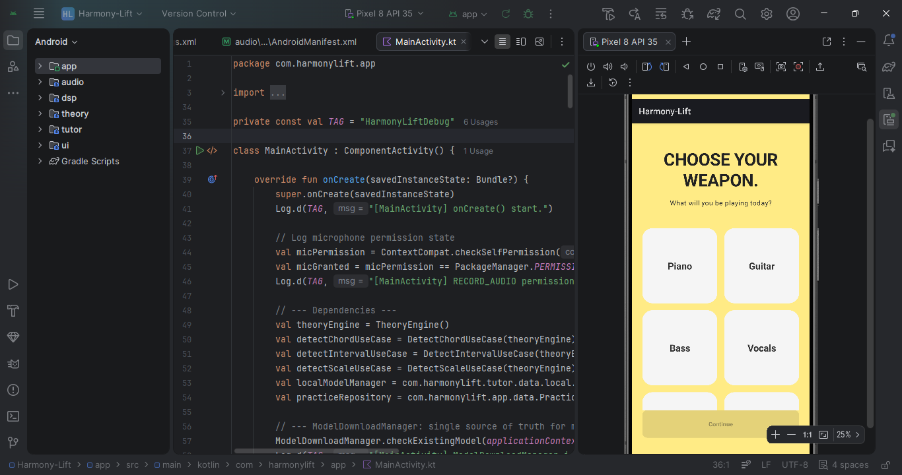 <br> *Settings Menu* |
| 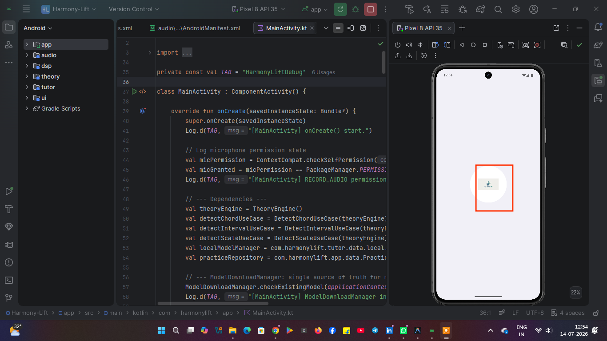 <br> *Scale Recognition* | 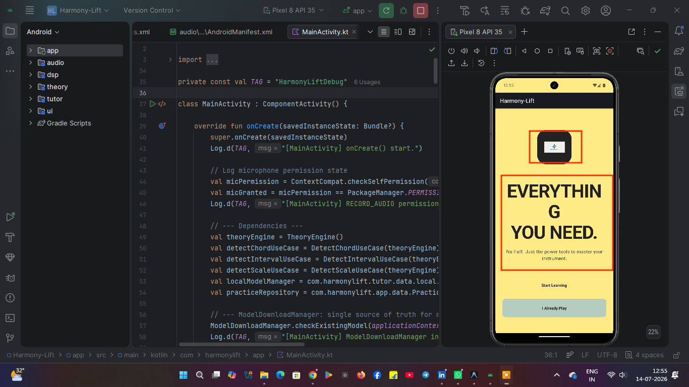 <br> *PDF Export* | 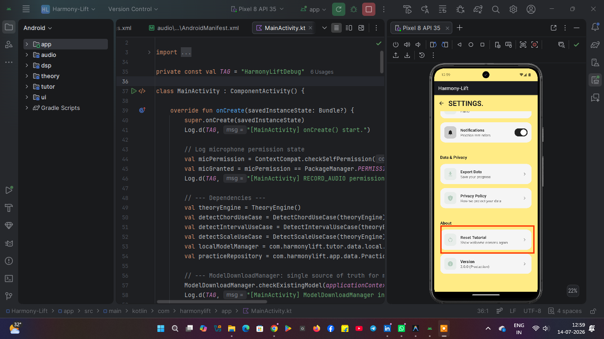 <br> *Progress Tracking* |
| 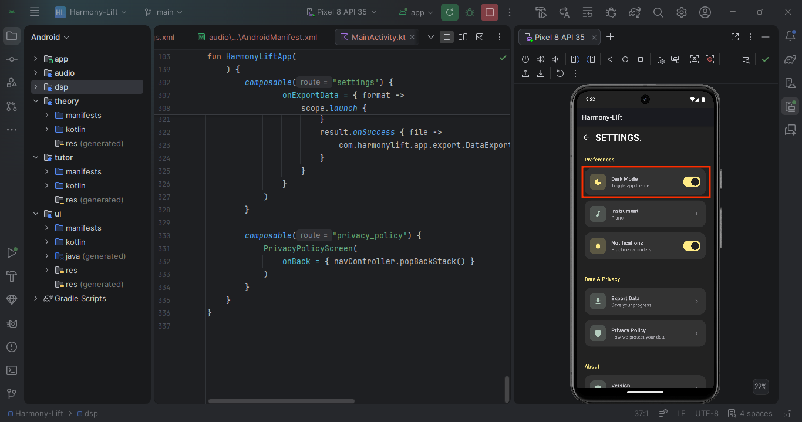 <br> *Theme Settings* | 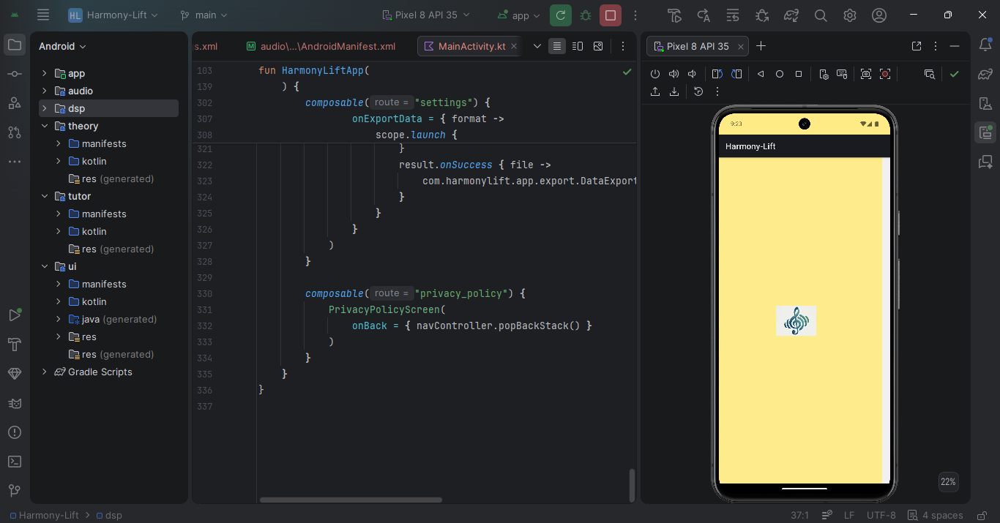 <br> *About Harmony-Lift* | |

</div>

---

## 🏗 Architecture

Harmony-Lift follows **Clean Architecture** with a strict separation of concerns across multiple Gradle modules.

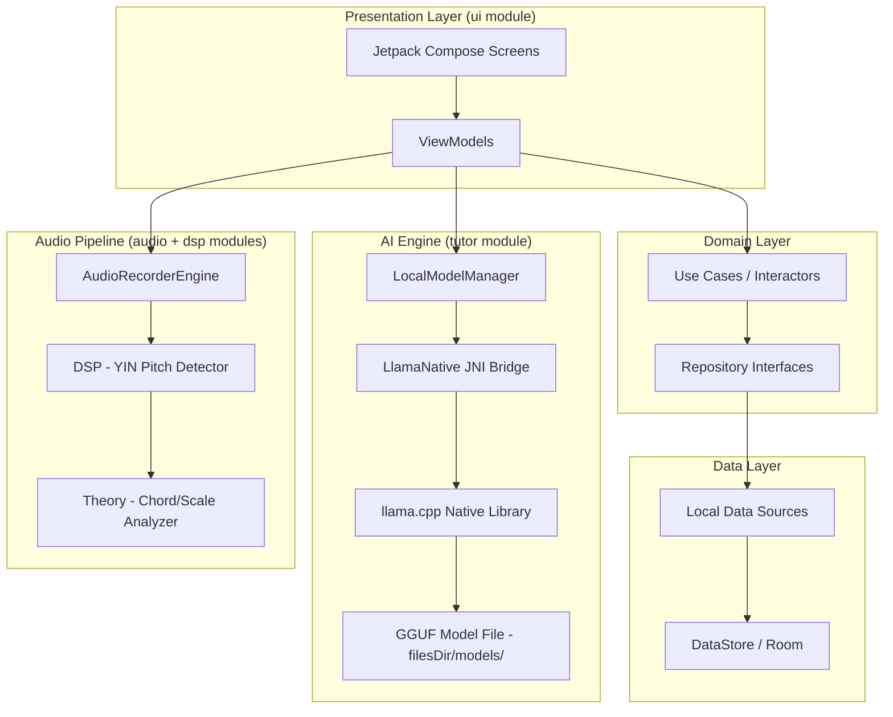

### Navigation Graph

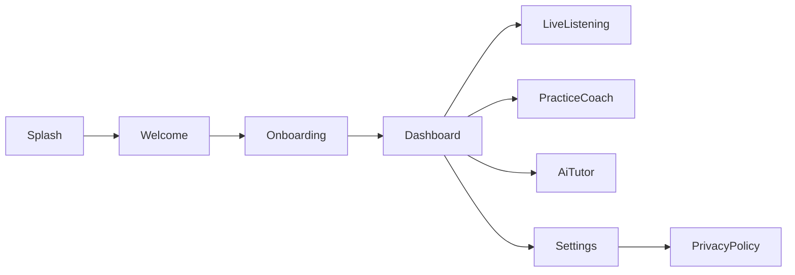

### Model Loading Flow

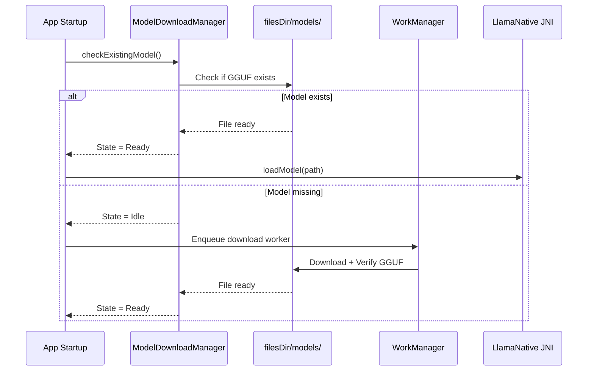

---

## 🛠 Tech Stack

| Category | Technology | Version |
|----------|-----------|---------|
| **Language** | Kotlin | 1.9.x |
| **UI Framework** | Jetpack Compose | BOM 2023.10 |
| **Design System** | Material Design 3 | Latest |
| **Architecture** | Clean Architecture + MVVM | — |
| **Async** | Kotlin Coroutines + Flow | 1.7.x |
| **Persistence** | DataStore Preferences | 1.0.x |
| **Background Work** | WorkManager | 2.9.x |
| **Navigation** | Navigation Compose | 2.7.x |
| **Audio** | Android AudioRecord API | SDK 26+ |
| **Pitch Detection** | YIN Algorithm (custom DSP) | — |
| **AI Runtime** | llama.cpp (JNI) | Latest |
| **Model Format** | GGUF | Llama 3.2 1B Instruct Q3_K_M |
| **Export** | Android PdfDocument + FileProvider | — |
| **Theme** | DataStore-backed Theme Switching | — |
| **CI/CD** | GitHub Actions | — |

---

## 📁 Folder Structure

```
Harmony-Lift/
├── 📦 app/                          # Main application module
│   ├── src/main/
│   │   ├── kotlin/com/harmonylift/app/
│   │   │   ├── MainActivity.kt      # Navigation host + DI root
│   │   │   ├── download/            # Model download pipeline
│   │   │   │   ├── ModelDownloadManager.kt
│   │   │   │   ├── ModelDownloadState.kt
│   │   │   │   └── ModelDownloadWorker.kt
│   │   │   ├── export/              # PDF/TXT export engine
│   │   │   │   └── DataExporter.kt
│   │   │   └── ui/                  # App-level UI (download screen)
│   │   │       └── ModelDownloadScreen.kt
│   │   ├── res/
│   │   │   └── xml/provider_paths.xml
│   │   └── AndroidManifest.xml
│   ├── build.gradle.kts
│   └── proguard-rules.pro
│
├── 🎵 audio/                        # Real-time audio recording engine
│   └── src/main/kotlin/com/harmonylift/audio/
│       ├── AudioRecorderEngine.kt   # Low-latency AudioRecord wrapper
│       └── AudioBuffer.kt           # Ring buffer for audio frames
│
├── 🔊 dsp/                          # Digital Signal Processing
│   └── src/main/kotlin/com/harmonylift/dsp/
│       └── PitchDetector.kt         # YIN pitch detection algorithm
│
├── 🎼 theory/                       # Music theory rules engine
│   └── src/main/kotlin/com/harmonylift/theory/
│       ├── ChordDetector.kt         # Chord identification from frequencies
│       └── ScaleDetector.kt         # Scale/mode recognition
│
├── 🤖 tutor/                        # Local AI engine module
│   └── src/main/kotlin/com/harmonylift/tutor/
│       ├── data/
│       │   ├── local/
│       │   │   ├── LocalModelManager.kt   # Llama model lifecycle
│       │   │   ├── LlamaCppService.kt     # LLMService implementation
│       │   │   └── LlamaNative.kt         # JNI bridge declarations
│       │   └── prompt/
│       │       └── TutorPromptBuilder.kt  # Llama 3.2 Instruct formatter
│       ├── domain/
│       │   └── repository/LLMService.kt
│       └── presentation/
│           ├── TheoryTutorViewModel.kt
│           ├── PracticeSessionViewModel.kt
│           └── *ViewModelFactory.kt
│
├── 🎨 ui/                           # All Compose UI components and screens
│   └── src/main/kotlin/com/harmonylift/ui/
│       ├── screens/
│       │   ├── SplashWelcomeScreens.kt
│       │   ├── OnboardingScreens.kt
│       │   ├── DashboardScreen.kt
│       │   ├── LiveListeningScreen.kt
│       │   ├── PracticeCoachScreen.kt
│       │   ├── AiTutorScreen.kt
│       │   ├── SettingsScreens.kt
│       │   └── PrivacyPolicyScreen.kt
│       └── theme/
│           ├── Theme.kt
│           ├── ThemePreferences.kt  # DataStore dark-mode persistence
│           └── Type.kt
│
├── 📚 docs/                         # Project documentation
│   ├── images/                      # Screenshots
│   └── Project_Context.md
│
├── .github/                         # GitHub configuration
│   ├── workflows/android.yml        # CI/CD pipeline
│   ├── ISSUE_TEMPLATE/
│   └── PULL_REQUEST_TEMPLATE.md
│
├── ARCHITECTURE.md
├── BUILDING.md
├── CHANGELOG.md
├── CODE_OF_CONDUCT.md
├── CONTRIBUTING.md
├── LICENSE
├── MODEL_SETUP.md
├── ROADMAP.md
├── SECURITY.md
└── README.md
```

---

## 🚀 Installation

### Requirements

| Tool | Minimum Version |
|------|----------------|
| Android Studio | Hedgehog 2023.1+ |
| Android SDK | API 26 (Android 8.0) |
| Android NDK | r25+ |
| CMake | 3.22+ |
| Java | 21 |
| Gradle | 8.x |

### Clone

```bash
git clone https://github.com/sayuj5/Harmony-Lift.git
cd Harmony-Lift
```

### Build (Debug)

```bash
./gradlew assembleDebug
```

Install on connected device:

```bash
./gradlew installDebug
```

---

## 🤖 Model Setup

The GGUF model file is **not committed** to this repository due to its large size (~600MB).

On first launch, the app will automatically download the model from HuggingFace using `WorkManager`. A progress indicator is displayed during the download.

**Manual installation:**

1. Download: [`Llama-3.2-1B-Instruct-Q3_K_M.gguf`](https://huggingface.co/bartowski/Llama-3.2-1B-Instruct-GGUF/resolve/main/Llama-3.2-1B-Instruct-Q3_K_M.gguf)
2. Push to device internal storage:
   ```bash
   adb push Llama-3.2-1B-Instruct-Q3_K_M.gguf /data/data/com.harmonylift.app/files/models/
   ```
3. Launch the app — it will detect and load the model automatically.

For full details, see [MODEL_SETUP.md](./MODEL_SETUP.md).

---

## 🔨 Build Instructions

### Debug Build
```bash
./gradlew assembleDebug
```

### Release Build
```bash
./gradlew assembleRelease
```

> Release builds have R8 minification and resource shrinking enabled via `proguard-rules.pro`. JNI symbols for `LlamaNative` are preserved.

For full signing and release instructions, see [BUILDING.md](./BUILDING.md).

---

## 🗺 Roadmap

- [x] Offline Llama 3.2 Local Inference
- [x] Real-time Pitch Detection (YIN)
- [x] Chord & Scale Detection
- [x] Practice Coach Mode
- [x] PDF & TXT Export
- [x] DataStore Dark Mode
- [x] Privacy Policy Screen
- [x] WorkManager Model Download
- [ ] MIDI Input Support
- [ ] Guitar Specific Mode
- [ ] Piano Mode
- [ ] Cloud Sync (optional, opt-in)
- [ ] AI Composer (melody generation)
- [ ] Lessons Marketplace
- [ ] Compose Multiplatform (iOS & Desktop)

See [ROADMAP.md](./ROADMAP.md) for details.

---

## ⚡ Performance

| Metric | Value |
|--------|-------|
| App Cold Start | < 2s |
| Pitch Detection Latency | < 50ms |
| LLM First Token | ~2-4s (device dependent) |
| Model Size (Q3_K_M) | ~600MB |
| RAM Usage (model loaded) | ~400-500MB |
| Min Android SDK | API 26 |

---

## 🔒 Privacy

Harmony-Lift is built with privacy as a first-class concern:

- ✅ **100% Offline** — No internet required after model download
- ✅ **No Analytics** — Zero telemetry, tracking, or crash reporting to cloud
- ✅ **No Ads** — Clean experience with no advertising
- ✅ **Audio Never Leaves Device** — All DSP and AI inference is local
- ✅ **No Account Required** — No sign-in, no email, no phone number
- ✅ **Open Source** — Full codebase is auditable

See [SECURITY.md](./SECURITY.md) for our security policy.

---

## 🐛 Known Issues

| Issue | Status | Workaround |
|-------|--------|-----------|
| LLM first inference is slow on low-RAM devices | Open | Reduce `nCtx` in `LocalModelManager` |
| AGC not available on some OEM devices | By Design | App logs warning, continues without it |
| Model download may be slow on metered connections | Open | Use Wi-Fi or manual ADB push |

---

## 🤝 Contributing

Contributions are welcome! Please read [CONTRIBUTING.md](./CONTRIBUTING.md) for the full workflow.

```bash
# Fork → Clone → Branch → Code → Test → PR
git checkout -b feat/your-feature-name
```

---

## 📄 License

```
MIT License — Copyright (c) 2026 Sayuj Sur
```

See [LICENSE](./LICENSE) for full text.

---

## 👤 Contributors

<a href="https://github.com/sayuj5/Harmony-Lift/graphs/contributors">
  
</a>

---

## 📊 Star History

[](https://star-history.com/#sayuj5/Harmony-Lift&Date)

---

<div align="center">

Made with ❤️ by [Sayuj Sur](https://github.com/sayuj5) | Powered by [llama.cpp](https://github.com/ggerganov/llama.cpp)

</div>
